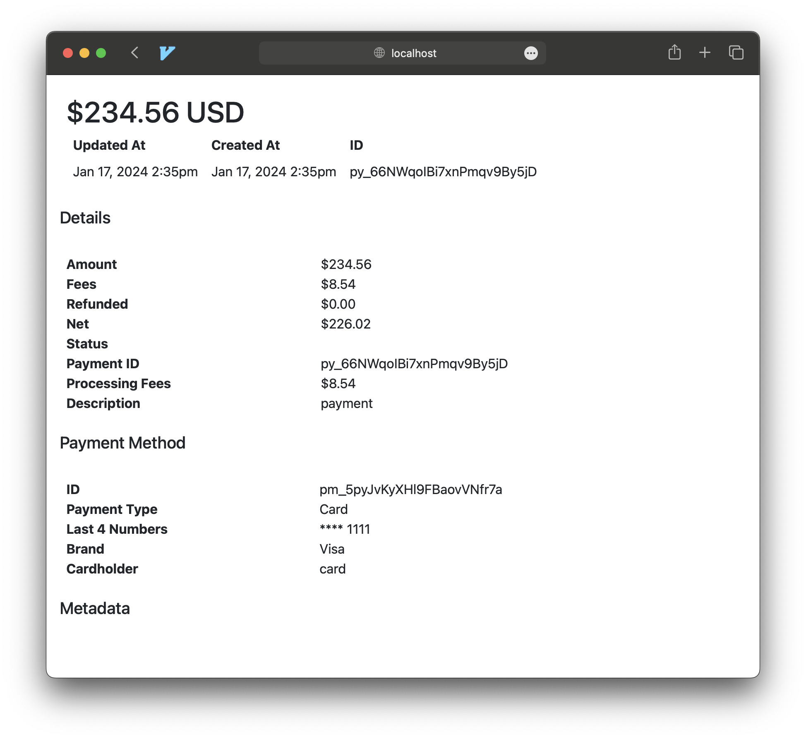
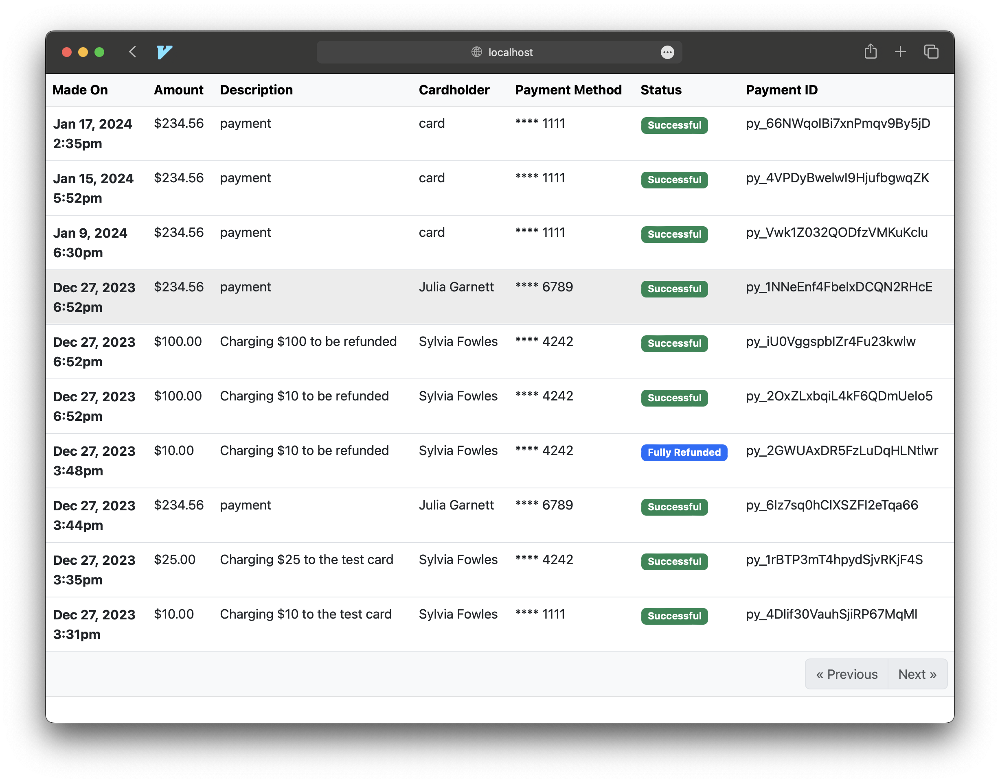
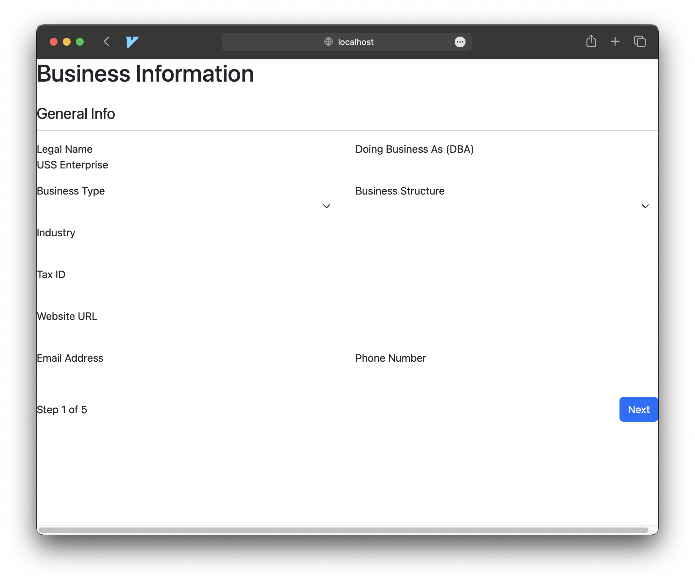

# Web Component Token Examples

## Overview of Web Component tokens

Due to the inherent risk of front end authorization, we have a fine-grained access token pattern for our web components. The following table describes which roles can be used to render a web component. We assume you have an authorize admin API key to complete the example API calls, and use that key to generate the Web Component Token.

### Roles need for each component

| Component              | Pre-Requisite        | Role                                                        |
| ---------------------- | -------------------- | ----------------------------------------------------------- |
| BusinessDetails        | Existing Business Id | read:business:`business_id` or write:business:`business_id` |
| BusinessForm           | Existing Business Id | write:business:`business_id`                                |
| BusinessFormStepped    | Existing Business Id | write:business:`business_id`                                |
| GrossPaymentChart      | Existing Sub Account | read:account:`account_id` or write:account:`id`             |
| PaymentDetails         | Existing Sub Account | read:account:`account_id` or write:account:`id`             |
| PaymentList            | Existing Sub Account | read:account:`account_id` or write:account:`id`             |
| PayoutDetails          | Existing Sub Account | read:account:`account_id` or write:account:`id`             |
| PayoutList             | Existing Sub Account | read:account:`account_id` or write:account:`id`             |
| Checkout               | Checkout created     | write:checkout:`checkout_id`                                |
| CardForm               | Existing Sub Account | write:tokenize:`account_id`                                 |
| BankAccountForm        | Existing Sub Account | write:tokenize:`account_id`                                 |

## General Usage

The pattern for using a web component starts in a backend request. Your backend should have a client token generated. Then, you need to find or create the resource the component needs to function, for example create a business before rendering the BusinessForm component. Next, you generate a web component token, which is good for 60 minutes, using the id(s) of the resources you will render. You then use this as the auth-token attribute to render the component in your front end.

### Here is an example of retrieving a payment and rendering the payment details.

The following steps show how to get the latest payment, generate a web component token, and render the PaymentDetails web component (copy and paste each block of code in a terminal to test using your credentials):

> We use [curl](https://curl.se/) to make the API calls in the terminal, and [jq](https://stedolan.github.io/jq/) to parse the json response.
> You can install using [homebrew](https://brew.sh/) on a mac or [chocolatey](https://chocolatey.org/) on windows.

1. Generate Access Token [API](https://docs.justifi.tech/api-spec#tag/API-Credentials/operation/CreateAccessToken)

```bash
ACCESS_TOKEN_RESPONSE=$(curl -sS --request POST \
  --url https://api.justifi.ai/oauth/token \
  --header 'Content-Type: application/json' \
  --data '{
    "client_id":"test_abc1234",
    "client_secret":"test_xyz9876"
  }'
)
```

2. Get the access\_token and print to the console

```bash
ACCESS_TOKEN=$(echo $ACCESS_TOKEN_RESPONSE | jq -r '.access_token')
echo "Access Token: ${ACCESS_TOKEN}"
```

3. List Payments [API](https://docs.justifi.tech/api-spec#tag/Payments/operation/ListPayments) using the access_token generated above and a test account:

```bash
ACCOUNT_ID="acc_abc1234"

PAYMENT_LIST=$(curl -sS --request GET \
  --url https://api.justifi.ai/v1/payments \
  --header 'Authorization: Bearer '${ACCESS_TOKEN}'' \
  --header 'Sub-Account: '${ACCOUNT_ID}''
)
```

4. Get the first payment\_id from payment list (= latest payment) and print to the console

```bash
PAYMENT_ID=$(echo ${PAYMENT_LIST} | jq -r '.data[0].id')
echo "Payment ID: ${PAYMENT_ID}"
```

5. Generate Web Component Token [API](https://docs.justifi.tech/api-spec#tag/Web-Component-Tokens) (*note: replace acc\_abc1234 with the account id from step 3*)

```bash
WC_TOKEN_RESPONSE=$(curl -sS --request POST \
  --url https://api.justifi.ai/v1/web_component_tokens \
  --header 'Authorization: Bearer '${ACCESS_TOKEN}'' \
  --header 'Content-Type: application/json' \
  --data '{ "resources": [ "read:account:acc_abc1234" ] }'
)
```

6. Get the web\_component\_token and print to the console (*note: this token is good for 60 minutes*)

```bash
WEB_COMPONENT_TOKEN=$(echo $WC_TOKEN_RESPONSE | jq -r '.access_token')
echo "Web Component Token: ${WEB_COMPONENT_TOKEN}"
```

#### Front end code: payment\_details.html

_note: replace WEB\_COMPONENT\_TOKEN and PAYMENT\_ID with the values from the terminal script above_

```html
<!doctype html>
<html dir="ltr" lang="en">
  <head>
    <meta charset="utf-8" />
    <meta
      name="viewport"
      content="width=device-width, initial-scale=1.0, minimum-scale=1.0, maximum-scale=5.0"
    />
    <title>justifi-payment-details</title>
    <script
      type="module"
      src="https://cdn.jsdelivr.net/npm/@justifi/webcomponents@4.7.4/dist/webcomponents/webcomponents.esm.js"
    ></script>
    <script
      nomodule
      src="https://cdn.jsdelivr.net/npm/@justifi/webcomponents@4.7.4/dist/webcomponents/webcomponents.js"
    ></script>
  </head>
  <body>
    <justifi-payment-details
      auth-token="${WEB_COMPONENT_TOKEN}"
      payment-id="${PAYMENT_ID}"
    >
    </justifi-payment-details>
  </body>
</html>
```

Open the file in your browser OR run a local web server (you may use any web server)

_note: if you have python3 installed, you can run the following command on the folder the html file was created to start a local web server._

```bash
# example using Python
python3 -m http.server
```

Open the file OR go to [http://localhost:8000/payment_details.html](http://localhost:8000/payment_details.html), you should see the [payment details web component](https://storybook.justifi.ai/?path=/docs/payment-facilitation-merchant-tools-payout-details--docs):



#### Front end code: payment\_list.html

_note: replace WEB\_COMPONENT\_TOKEN and ACCOUNT\_ID with the values from the terminal script above_

```html
<!doctype html>
<html dir="ltr" lang="en">
  <head>
    <meta charset="utf-8" />
    <meta
      name="viewport"
      content="width=device-width, initial-scale=1.0, minimum-scale=1.0, maximum-scale=5.0"
    />
    <title>justifi-payments-list</title>
    <script
      type="module"
      src="https://cdn.jsdelivr.net/npm/@justifi/webcomponents@4.7.4/dist/webcomponents/webcomponents.esm.js"
    ></script>
    <script
      nomodule
      src="https://cdn.jsdelivr.net/npm/@justifi/webcomponents@4.7.4/dist/webcomponents/webcomponents.js"
    ></script>
  </head>
  <body>
    <justifi-payments-list
      auth-token="${WEB_COMPONENT_TOKEN}"
      account-id="${ACCOUNT_ID}"
    >
    </justifi-payments-list>
    <script>
      window.addEventListener("payment-row-clicked", (event) => {
        // event.detail contains all the necessary information to call an endpoint to get more details on this entity
        const entityID = event.detail.id;
        alert(`You clicked on ${entityID}`);
      });
    </script>
  </body>
</html>
```

Open the file or go to [http://localhost:8000/payment_list.html](http://localhost:8000/payment_list.html), you should see the [payment list web component](https://storybook.justifi.ai/?path=/docs/payment-facilitation-merchant-tools-payments-list--docs):



### Here is an example of creating a business and rendering the stepped onboarding component.

The following steps shows how to create a business entity, generate a web component token, and render the [BusinessFormStepped web component](https://storybook.justifi.ai/?path=/docs/components-businessformstepped--docs):

1. Generate Access Token [API](https://docs.justifi.tech/api-spec#tag/API-Credentials/operation/CreateAccessToken)

```bash
ACCESS_TOKEN_RESPONSE=$(curl -sS --request POST \
  --url https://api.justifi.ai/oauth/token \
  --header 'Content-Type: application/json' \
  --data '{
    "client_id":"test_abc1234",
    "client_secret":"test_xyz9876" 
  }'
)
```

2. Get the access_token from the response and print to the console

```bash
ACCESS_TOKEN=$(echo $ACCESS_TOKEN_RESPONSE | jq -r '.access_token')
echo "Access Token: ${ACCESS_TOKEN}"
```

3. Create a business entity [API](https://docs.justifi.tech/api-spec#tag/Business/operation/CreateBusiness) using the access_token generated above:

```bash
BUSINESS_RESPONSE=$(curl -sS --request POST \
  --url https://api.justifi.ai/v1/entities/business \
  --header 'Authorization: Bearer '${ACCESS_TOKEN}'' \
  --header 'Content-Type: application/json' \
  --data '{
	  "legal_name": "USS Enterprise" 
  }'
)
```

4. Get the business\_id from the resopnse and print to the console

```bash
BUSINESS_ID=$(echo ${BUSINESS_RESPONSE} | jq -r '.id')
echo "Business ID: ${BUSINESS_ID}"
```

5. Generate Web Component Token [API](https://docs.justifi.tech/api-spec#tag/Web-Component-Tokens) (*note: replace biz\_abc1234 with the business id from step 4 above*)

```bash
WC_TOKEN_RESPONSE=$(curl -sS --request POST \
  --url https://api.justifi.ai/v1/web_component_tokens \
  --header 'Authorization: Bearer '${ACCESS_TOKEN}'' \
  --header 'Content-Type: application/json' \
  --data '{ "resources": [ "write:business:biz_abc1234" ] }'
)
```

6. Get the web\_component\_token from the response and print to the console

```bash
WEB_COMPONENT_TOKEN=$(echo $WC_TOKEN_RESPONSE | jq -r '.access_token')
echo "Web Component Token: ${WEB_COMPONENT_TOKEN}"
```

#### Front end code: business_form_stepped.html

_note: replace WEB\_COMPONENT\_TOKEN and BUSINESS\_ID with the values from the terminal script above_

```html
<!doctype html>
<html dir="ltr" lang="en">
  <head>
    <meta charset="utf-8" />
    <meta
      name="viewport"
      content="width=device-width, initial-scale=1.0, minimum-scale=1.0, maximum-scale=5.0"
    />
    <title>justifi-payment-details</title>
    <script
      type="module"
      src="https://cdn.jsdelivr.net/npm/@justifi/webcomponents@4.7.4/dist/webcomponents/webcomponents.esm.js"
    ></script>
    <script
      nomodule
      src="https://cdn.jsdelivr.net/npm/@justifi/webcomponents@4.7.4/dist/webcomponents/webcomponents.js"
    ></script>
  </head>
  <body>
    <justifi-business-form-stepped
      auth-token="${WEB_COMPONENT_TOKEN}"
      business-id="${BUSINESS_ID}"
      account-id="${ACCOUNT_ID}"
    >
    </justifi-business-form-stepped>
  </body>
</html>
```

Open the file or go to [http://localhost:8000/business_form_stepped.html](http://localhost:8000/business_form_stepped.html), you should see the business form stepped used for Onboarding:



## Example Web Component implementations

### Payment/Payout Components

To use our payment and payout components, you must grant a web component token for the sub account for which you'd like to show the payments or payouts.

- Choose the sub account id (acc_abc1234)
- With business OR sub account id, generate WC session read:account:`id`
- Render component

### Business Onboarding

- Create a business via create business API
- Create Web Compontent Token for Business write:business:`id`
- (optional) confirm WC token on Customer Admin Dashboard
- Render the Stepped Onboarding Component with the WC Token (note good 60 minutes)

#### (optional) Active business for payments

- Accept terms of service
- (optional) Provision Payments product
- Render component, good for 60 minutes

### View Business Details Management

- With Business ID, generate WC session read:business:`id`
- Render Component

## Future documentation

We will document our checkout components and the card, bank account and payment forms here as they become available.
